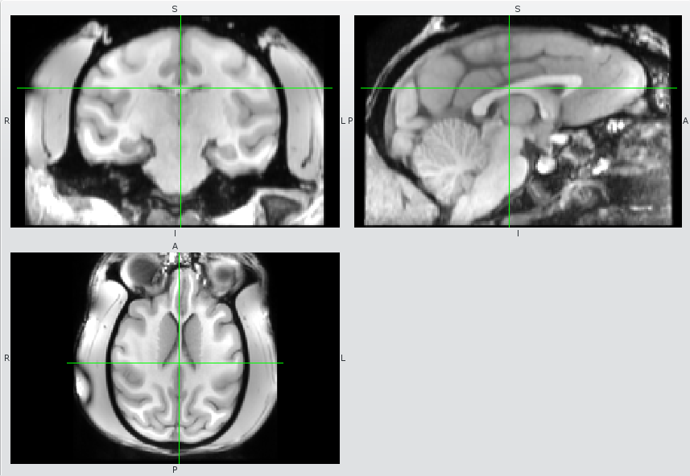

Processing the T1 anatomical
----------------------------

The standard location for T1 data is `/NHP_MRI/Data_proc/SUBJ/DATE/anat/T1`. Example scripts are at: `/NHP_MRI/Data_proc/EDDY/20170614/anat/T1/process_t1-step*.sh`.

### Pre-processing

If you are combining different types of T1's, use something like the following:

    #!/bin/bash

    set -e # exit if a command fails

    # --- First process the T1's individually
    FILES="T1_07.nii.gz
    T1_10.nii.gz
    T1_12.nii.gz"

    preprocess_indiv () {
      local f=$1
      b=${f%.nii.gz}
      mri_convert -i ${b}.nii.gz -o ${b}_ro.nii.gz --sphinx -vs 0.5 0.5 0.5
      fslreorient2std ${b}_ro.nii.gz ${b}_ro.nii.gz
      mri_nu_correct.mni --i ${b}_ro.nii.gz --o ${b}_nu.nii.gz --distance 24
    }

    for f in $FILES; do
      preprocess_indiv $f &
    done

    wait # wait for individual file preprocessing
    
Note that `N4BiasFieldCorrection` could be used instead of mri_nu_correct.mni, if mri_nu_correct.mni is difficult to get working on your system.

### Using the BET command

Get the approximate middle coordinate (somewhere in the pons) and write them down (<x y z>)

    fslview T1_image &

JW: BET might work better a little higher up, like this:

Extract the brain using fsl’s BET routine (you may need to tweak the optional parameters a bit for the best result)

    bet inputfile outputfile(preferably ‘inputfile_brain’) -f 0.3 -c <x y z>

JW note: I find that `-f 0.55` works better for our data.

ME note:
* running ``bet`` with ``-R`` (robust option) gives generally favorable results
* tuning the ``-f`` parameter around the range ``f=0.11-0.9`` gives results that include the frontal pole (but also include some non-brain tissue anterior to the pons; in my experience that had no negative effect for the registration).

You can also use the gui:

    Bet &

### Performing Brain extraction with Freesurfer

Brain extraction sometimes works better with Freesurfer

(JW) from 20170524/anat/T1/process_t1-step2_freesurfer.sh

    # -- Convert for freesurfer
    # Not performing crop, b/c it doesn't seem needed and I want to put back in the
    #   coordinates.
    mri_convert -i T1_avg_nu.nii.gz -o orig.mgz --in_orientation RAS -iis 1 -ijs 1 -iks 1

    # Should give different subjid for each run or delete existing folder (or not use the -i option below...)
    subjid=EDDY_20170524-2
    recon-all -i orig.mgz -subjid $subjid -autorecon1 -skullstrip -no-wsgcaatlas -wsthresh 15 -notal-check -notalairach -clean-bm -gcut

    # Lowering threshold will reduce the brain region, could be reduced further
    #recon-all -i orig.mgz -subjid $subjid -autorecon1 -no-wsgcaatlas -wsthresh 20 -notal-check -notalairach

    #recon-all -subjid $subjid -skullstrip -no-wsgcaatlas -wsthresh 15 -notal-check -notalairach -clean-bm -gcut

    # Copy file from freesurfer subject directory to current directory
    # will need to be modified, freesurfer must provide a better way to do this...
    cp /big/freesurfer-subjects/$subjid/mri/brainmask.mgz .

    # Return to original scale and coordinates
    mri_convert -i brainmask.mgz -o brainmask.nii.gz --out_orientation RAS -iis 0.5 -ijs 0.5 -iks 0.5

    # "-n" prevents overwritting (in my version)
    cp -n brainmask.nii.gz brainmask.manual.nii.gz

    # Convert into mask (0 or 255)
    fslmaths brainmask.manual.nii.gz -bin -mul 255 brainmask.manual.nii.gz

    # Edit with freeview
    freeview T1_avg_nu.nii.gz brainmask.manual.nii.gz:colormap=Heat:opacity=0.4
